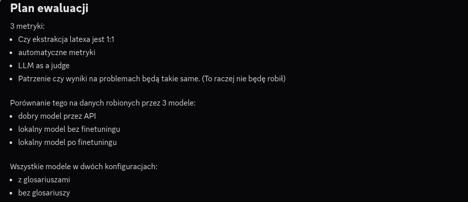

# Setup

### Configure DVC remote credentials

```bash
dvc remote modify origin --local auth basic
dvc remote modify origin --local user YOUR_DAGSHUB_USERNAME
dvc remote modify origin --local password YOUR_DAGSHUB_TOKEN
```

Get your token from: DagsHub → Settings → Access Tokens

### Pull the data

```bash
dvc pull
```

This downloads all DVC-tracked files into `data/raw/`.

---

## Project structure

```
├── .dvc/                         # DVC configuration
├── data.dvc                      # DVC pointer for data/
├── eval_results.dvc              # DVC pointer for eval_results/
├── data/                         # datasets (tracked by DVC)
│   ├── raw/                      # raw scraped data
│   ├── processed/                # cleaned data + glossary sources (source1–5, master_final*)
│   └── *.jsonl                   # translation outputs (ready_dataset, translations_output*)
├── models/                       # trained models (tracked by DVC)
├── src/                          # training and processing code
│   ├── fine-tuning/              # SFT/LoRA training (train.py, config.py, run_training.sh, setup.sh)
│   ├── glos_api/                 # glossary-augmented translation pipeline (pipeline.py, query_glos.py, prompts.py, api.py, config.yaml)
│   ├── glossary/                 # glossary building (build_glos.py, glos_playground.ipynb)
│   ├── dataset*.ipynb            # dataset creation & preprocessing notebooks
│   ├── *_translation.ipynb       # api / baseline translation notebooks
│   ├── translation_eval.ipynb    # translation evaluation notebook
│   └── inspect_math_errors.ipynb
├── evaluation/                   # evaluation harness
│   ├── run_eval.py               # main entry point
│   ├── translate.py              # model loading + translation
│   ├── download_model.py
│   ├── metrics/                  # metric implementations (latex_preservation, comet_score, llm_judge)
│   └── visualisations/           # metric_0–3 plotting notebooks
├── eval_results/                 # evaluation outputs (tracked by DVC — see section 5)
├── assets/                       # images used in the report
├── INSTRUCTIONS.md               # this file
├── Report.md                     # project report
└── README.md
```

---

## Daily workflow

### Make changes and reproduce the pipeline

```bash
# after modifying scripts or adding data
dvc repro
```

### Push changes

```bash
dvc push          # push data/models to DagsHub
git add .
git commit -m "your message"
git push
```

---

## Adding new data

1. Place the file in `data/raw/`
2. Track it with DVC:

```bash
dvc add data/raw/your_file.csv
```

3. Commit and push:

```bash
git add data/raw/your_file.csv.dvc data/raw/.gitignore
git commit -m "data: add your_file.csv"
git push origin main
dvc push
```

---

## Running the pipeline

> Pipeline stages will be defined in `dvc.yaml` as the project develops.

Once defined, run the full pipeline with:

```bash
dvc repro
```

DVC will only re-run stages whose dependencies have changed.

---

## Notes

- Never commit raw data files directly to Git — always use `dvc add`
- `.dvc/config.local` holds your credentials and is gitignored by default




# Evaluation — How to Run

All commands must be run from the **project root** (`Trump_GPT/`).

---

## 1. Setup (main environment)

### Install dependencies

```bash
pip install torch transformers accelerate bitsandbytes huggingface_hub requests python-dotenv spacy pyyaml
python -m spacy download en_core_web_sm
```

> **Do NOT install `unbabel-comet` in this environment** — it requires `transformers<5.0`
> which breaks Gemma 4. Use the separate `venv_comet` for COMET (see section below).

### Log in to HuggingFace

Required to download Gemma, the finetuned model, and the COMET model (all gated/private):

```bash
huggingface-cli login
```

Models are downloaded automatically on first run — no separate download step needed.

### Environment variables

Required only when using the API model or LLM judge. Create `.env` at the project root:

```
PCSS_API_KEY=your_token_here
PCSS_BASE_URL=https://llm.hpc.psnc.pl/v1/chat/completions
```

`PCSS_BASE_URL` is optional — the value above is the default.
If running with `--skip-api` and `--translate-only`, `.env` can be empty or omitted.

---

## 2. Prepare the evaluation set

The script always reads source examples from `eval_results/eval_set.jsonl` and translations
from `eval_results/translations/`. These files must exist before running evaluation.

Format of `eval_set.jsonl` — one JSON per line:
```json
{"idx": 1251, "problem": "...", "solution": "..."}
```

Format of each translation cache file (e.g. `translations/local_no_glos.jsonl`):
```json
{"idx": 1251, "problem_pl": "...", "solution_pl": "..."}
```

---

## 3. Run the evaluation

### Without COMET (main environment)

```bash
# Metric 1 only (LaTeX preservation)
python evaluation/run_eval.py --eval-only --run-latex

# Metric 1 + LLM judge
python evaluation/run_eval.py --eval-only --run-latex --run-llm-judge

# Translate with local + finetuned models, then compute metrics
python evaluation/run_eval.py --skip-api

# Translate only (no metrics), skip API
python evaluation/run_eval.py --translate-only --skip-api
```

### With COMET (separate venv_comet)

COMET requires `transformers<5.0` which conflicts with Gemma 4. Use a dedicated venv:

**One-time setup:**
```bash
python -m venv venv_comet
source venv_comet/bin/activate
pip install torch "transformers==4.46.0" unbabel-comet
```

You also need to accept the model terms of use:
go to [huggingface.co/Unbabel/wmt22-cometkiwi-da](https://huggingface.co/Unbabel/wmt22-cometkiwi-da)
and login and click "accept terms of use"

also:
```bash
huggingface-cli login
```

**Run COMET evaluation:**
```bash
source venv_comet/bin/activate
python evaluation/run_eval.py --eval-only --run-comet
```

COMET runs on CPU (~3 min per config × 6 configs). Per-config scores are cached in
`eval_results/metrics/metric_2/scores/` so interrupted runs resume automatically.

---

## 4. All options

| Argument | Default | Description |
|---|---|---|
| `--num-examples` | all | Number of examples to use from `eval_set.jsonl` |
| `--local-model` | `google/gemma-4-E4B-it` | Local path or HuggingFace Hub ID for base model, or `none` to skip |
| `--finetuned-model` | `Igor-S-666/gemma4-math-translation-2026-06-02_10.36.07` | Local path or HuggingFace Hub ID for finetuned model, or `none` to skip |
| `--eval-only` | off | **Skip all model loading and translation** — compute metrics from existing caches only |
| `--translate-only` | off | Only run translations (with timing), skip all metric computation |
| `--skip-api` | off | Skip the API model (use when no PCSS API key is available) |
| `--run-latex` | off | Run Metric 1: LaTeX preservation score |
| `--run-comet` | off | Run Metric 2: COMET QE (requires `venv_comet` — see above) |
| `--run-llm-judge` | off | Run Metric 3: LLM-as-judge scoring |
| `--judge-model` | `gpt-oss_120b` | Model to use as LLM judge |

---

## 5. Output

Results are saved to `eval_results/` (gitignored):

```
eval_results/
├── eval_set.jsonl                  # English source examples
├── translations/                   # cached translations (one JSONL per config)
│   ├── api_no_glos.jsonl
│   ├── api_glos.jsonl
│   ├── local_no_glos.jsonl
│   ├── local_glos.jsonl
│   ├── finetuned_no_glos.jsonl
│   └── finetuned_glos.jsonl
└── metrics/
    ├── metric_0.jsonl              # per-example translation time (fresh runs only)
    ├── metric_1.jsonl              # per-example LaTeX preservation score
    ├── metric_2.jsonl              # per-example COMET score
    ├── metric_2/scores/            # intermediate per-config COMET cache
    ├── metric_3.jsonl              # per-example LLM judge scores
    └── metric_3/scores/            # intermediate per-config judge cache
```

Each metric JSONL has one line per example with scores for all 6 model/glossary configs:
```json
{"idx": 1251, "api_no_glos": {"problem": 1.0, "solution": 0.85}, "api_glos": {...}, ...}
```
`null` means no translation exists for that config+example.

---

## 6. Metrics

### Metric 0 — Translation time

Per-example time in seconds (problem + solution together). Only recorded for freshly
translated examples — re-running cached translations produces no timing output.

### Metric 1 — LaTeX preservation (`--run-latex`)

Fraction of `$...$` and `$$...$$` math segments from the source that appear identically
in the translation (after normalizing `\_` → `_` and `a_11` → `a_{11}`).

### Metric 2 — COMET QE (`--run-comet`, venv_comet only)

Reference-free quality estimation using `Unbabel/wmt22-cometkiwi-da`.
Input: (English source, Polish translation). Output: score ~[0, 1].
Requires separate `venv_comet` environment and HuggingFace access (see section 3).

### Metric 3 — LLM judge (`--run-llm-judge`)

Uses `gpt-oss_120b` via the PCSS API to rate each translation on 5 criteria (1–5):
`mathematical_accuracy`, `terminology`, `grammar`, `naturalness`, `completeness`.
Requires `PCSS_API_KEY` in `.env`. Scores are cached per example.

---

## 7. Resuming interrupted runs

Translations and metric scores are written to disk immediately after each example.
Re-run the same command to continue — completed examples are skipped automatically.

---

## 8. Hardware requirements

- **GPU with ~8–10 GB VRAM** required to run local or finetuned models (4-bit NF4 quantization)
- API model, COMET, and LLM judge all run without a GPU
- Models are loaded sequentially (local → finetuned) to avoid holding two in VRAM at once
