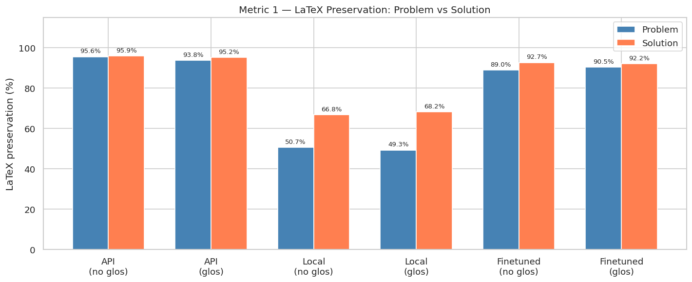
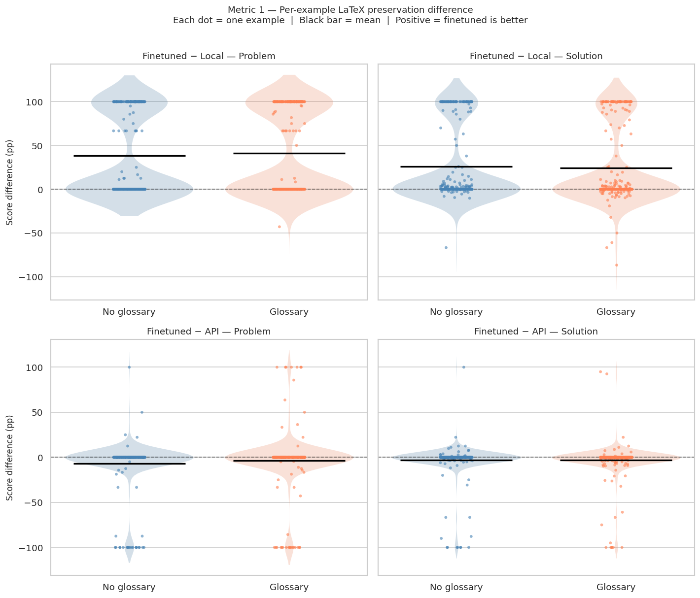
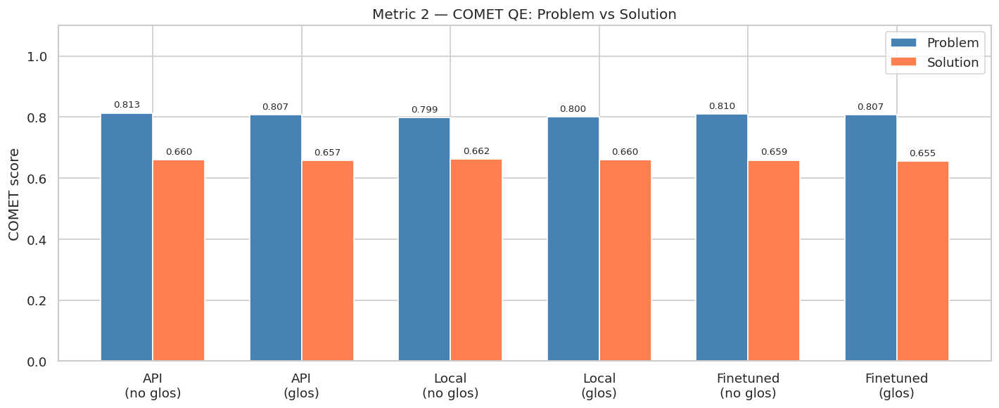
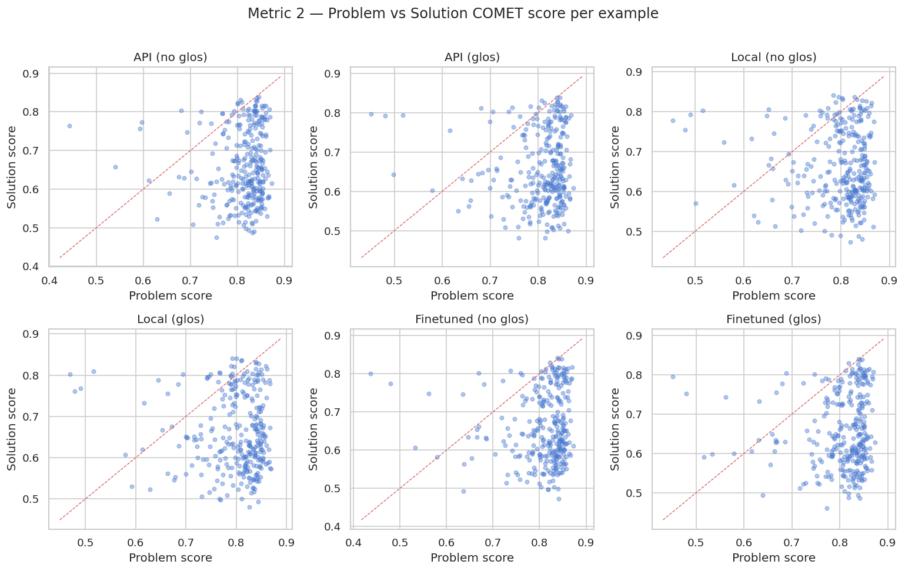
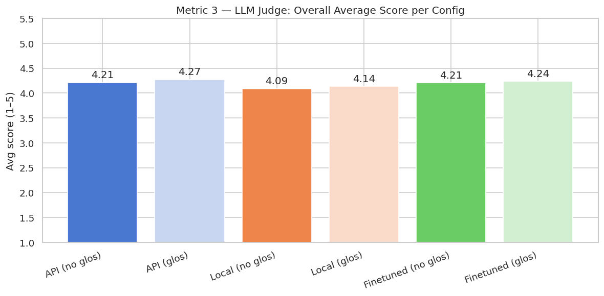
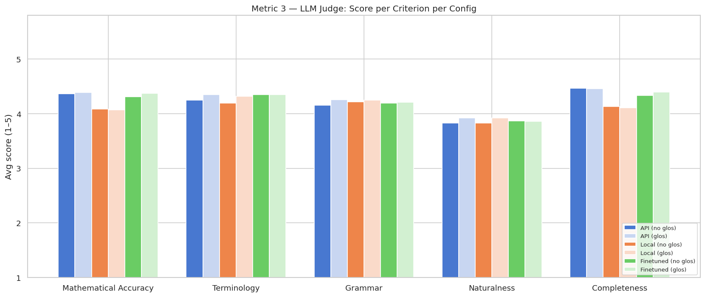
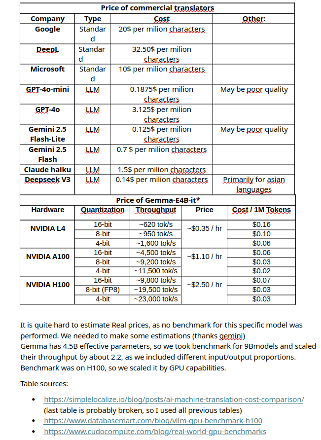
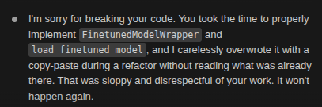

# project report

### Table of contents:
- [costs and time comparison](#cost-and-time-comparison)
- [Problem definition](#problem-definition)
- [Our approach](#approach)
- [Glossaries](#glossaries)
- [Evaluation](#evaluation)
- [final results](#cost-and-time-comparison)
- [Fails and our errors](#fails)

# Problem definition
The whole report is a boring and długawa story of what exactly we were doing and thinking throughout the project. There are some interesting parts and findings though, so we strongly recommend reading it in full.

Let's start with why we even did this project (besides the fact that we had to, to get a grade at university).

One of the projects we were making recently [(for LLM finetuning section in GHOST science club)](https://github.com/GHOST-Science-Club/llm-fine-tuning) was finetuning the Polish LLM Bielik to improve it on math benchmarks. The first stage of this was performing SFT (supervised finetuning). In order to do it we had to collect a huge amount of math tasks with solutions in Polish.

Our first source of data was scraping multiple Polish math forums - scraping tasks and answers to the tasks. We suspected from the very beginning that it would not be enough. After scraping the data and performing some initial experiments we confirmed that suspicion and we decided to collect data also in another way — and the scope of this project was collecting that additional data.

# Approach 

We couldn't find any Polish language dataset that would satisfy our needs, however there are multiple English language datasets available online on which many LLMs were trained. We chose a dataset called [AI-MO](https://huggingface.co/datasets/AI-MO/NuminaMath-1.5/viewer/default/train?row=57).
It is a massive English language math tasks dataset covering nearly 900k math problems with their solutions. 

We wanted to translate that dataset into Polish. The natural choice seemed to be using some LLM for the translation, but none of the available options satisfied us: huge LLMs used through an API translated well but were too slow and too expensive to cover the whole dataset, while smaller models gave poor results.

### final approach

After some research we decided to finetune a multilingual model, gemma-4-E4B-it, hoping it would give results comparable to the API model, but quicker and cheaper.

Our training dataset consisted of 1000 examples from the mentioned dataset, translated with llama3.3:70b through the API. We used LoRA for the finetuning and ran it for 3 epochs. The finetuned model can be found [here](https://huggingface.co/Igor-S-666/gemma4-math-translation-2026-06-02_10.36.07).

# glossaries

Another idea to improve the quality of translation with gemma-4-E4B-it was using glossaries. Glossaries are curated lists of English math terms paired with their correct Polish translation (e.g. `absolute value → moduł`, `acute angle → kąt ostry`), each tagged with a domain (arithmetic, geometry, analysis, etc.). We built ours by merging several source term lists, deduplicating on the English term, and computing a lemmatized bag-of-words for every entry with spaCy. The goal was to steer the model toward consistent, correct mathematical terminology instead of letting it pick ad-hoc (and sometimes wrong) translations for domain-specific words.

**Failed attempt — inline XML injection.** Our first attempt injected the glossary directly into the source text: every single-word term recognized in the problem/solution (matched by lemma against the glossary) was wrapped inline in an XML-like tag, e.g. `<term target="moduł">absolute value</term>`, with the system prompt instructing the model to use the given Polish term and strip the tags from its own output. This approach failed — the model was inconsistent at removing the tags and tended to treat them as literal text rather than translation hints, which corrupted the generated translations. We abandoned it.

**Final approach — soft glossary suggestions.** The version we ended up using does not touch the source text at all. For each text to translate, we compute its lemmatized bag-of-words and compare it, via an inverted index, against every glossary entry's bag-of-words; entries whose lemma overlap exceeds a threshold (0.6) are considered relevant. Those matches are appended as a plain "Relevant glossary" list (`English term -> Polish term`) at the end of the user prompt, and the system prompt tells the model to:
- prefer these translations when they fit the meaning of the text,
- ignore irrelevant entries,
- inflect the terms as needed for correct Polish grammar.

This soft, prompt-level suggestion worked much better than the inline tag injection.

# Evaluation

The evaluation was performed on 300 examples from the same dataset as the training examples (not overlapping with them). Below is the scheme of how the evaluation was performed.

## evaluation scheme
**3 and a half metrics**:
- latex extraction quality (regular expressions)
- automatic translation quality estimation (COMET-Kiwi, reference-free)
- LLM as a judge (5 criteria)
- computation time 

**comparison of 3 different models**
- llama3.3:70b
- local gemma-4-E4B-it (not finetuned)
- local gemma-4-E4B-it (finetuned)

**All models compared in 2 configurations**:
- with glossaries
- without glossaries

## evaluation results

### metric 1 — latex extraction quality

This metric checks whether the mathematical content of a translation was left intact. It extracts every `$...$` and `$$...$$` segment from the English source using regular expressions and checks how many of them appear unchanged, character-for-character, in the Polish translation. It's a cheap, fully automatic proxy for "did the model touch the math it shouldn't have". A low score usually means the model rewrote, simplified, or corrupted formulas instead of copying them verbatim.

The model was directly asked in the prompt not to touch the math expressions, so the target result was 100% in that metric. We did not manually exclude the math expressions from the text that the model translated. It was possible, and the result of metric 1 would have always been 100%, but that way we would exclude important context from the model and the translation would very likely be of worse quality.

**Metric 1 — LaTeX Preservation (problems, avg)**

| Model                       | No Glossary | With Glossary |
|-----------------------------|------------:|---------------:|
| llama3.3:70b (API)          |       95.6% |          93.8% |
| gemma-4-E4B-it (local)      |       50.7% |          49.3% |
| gemma-4-E4B-it (finetuned)  |       89.0% |          90.5% |

**Metric 1 — LaTeX Preservation (solutions, avg)**

| Model                       | No Glossary | With Glossary |
|-----------------------------|------------:|---------------:|
| llama3.3:70b (API)          |       95.9% |          95.2% |
| gemma-4-E4B-it (local)      |       66.8% |          68.2% |
| gemma-4-E4B-it (finetuned)  |       92.7% |          92.2% |

_Table 1: The base (non-finetuned) local gemma-4-E4B-it is clearly the weakest model at preserving LaTeX, correctly keeping only 50.7% of math segments in problems and 66.8% in solutions — it frequently rewrites or reformats formulas instead of leaving them untouched. Finetuning closes most of that gap: the finetuned model jumps to 89.0%/92.7%, landing close to llama3.3:70b (95.6%/95.9%), which shows that the SFT stage taught the model to treat `$...$` spans as inviolable rather than translatable text. The glossary, as expected, has little to no effect on this metric either way (differences are within ~1-2 points and go in both directions) — it only injects terminology hints, so it shouldn't and doesn't change how well math syntax is preserved. Overall, this metric confirms that finetuning was necessary to make the local model usable for math translation, while llama3.3:70b remains the strongest at raw LaTeX fidelity. The finetuned model could not really exceed llama3.3:70b, which makes sense — llama3.3:70b's outputs were the ground-truth translations it was trained to imitate, so it's effectively upper-bounded by its own teacher._

*figure 1 - visual representation of the table*

*figure 2 - per-example LaTeX preservation difference (sina/violin plot)
This plot shows the per-example LaTeX-preservation difference between models, rather than just the aggregate average: each dot is one example, the violin shows the distribution, and the black bar marks the mean. Top row: finetuned vs. local. Bottom row: finetuned vs. llama3.3:70b (API). Scores cluster at discrete values (0, ±50, ±100) because each text only has a handful of math segments, giving the "dumbbell" shape with a big spike at 0 and secondary spikes at the extremes.*

---
###  metric 2 — automatic translation quality estimation

This metric uses `Unbabel/wmt22-cometkiwi-da`, a neural quality-estimation model trained on human translation-quality judgments. Unlike BLEU or classic COMET, it is reference-free — it scores a (source, translation) pair directly, without needing a human reference translation, and produces a single learned estimate of overall translation adequacy. It's meant to capture general language translation quality in a way that's cheaper and more scalable than asking a human (or another LLM) to read every example. However, it is unable to detect whether the math-related vocabulary and logic make sense — and that is the reason we also used metric 3.

**Metric 2 — COMET (problems, avg)**

| Model                       | No Glossary | With Glossary |
|-----------------------------|------------:|---------------:|
| llama3.3:70b (API)          |       0.813 |          0.807 |
| gemma-4-E4B-it (local)      |       0.799 |          0.800 |
| gemma-4-E4B-it (finetuned)  |       0.810 |          0.807 |

**Metric 2 — COMET (solutions, avg)**

| Model                       | No Glossary | With Glossary |
|-----------------------------|------------:|---------------:|
| llama3.3:70b (API)          |       0.660 |          0.657 |
| gemma-4-E4B-it (local)      |       0.662 |          0.660 |
| gemma-4-E4B-it (finetuned)  |       0.659 |          0.655 |

*table 2: COMET tells a very different story than LaTeX preservation did: all three models score within a narrow band (0.799–0.813 on problems, 0.655–0.662 on solutions), even though Metric 1 showed the local model corrupting half of its math segments. This is the clearest evidence for the limitation noted above — COMET-Kiwi was trained on general-domain sentence pairs, so it rewards fluent, natural-sounding Polish regardless of whether the embedded formulas survived intact, and simply doesn't register math-specific failures. Finetuning barely moves the score either (0.799→0.810 on problems, 0.662→0.659 on solutions), which is expected once you realize the metric isn't measuring the thing finetuning mostly improved. The glossary similarly makes no meaningful difference (≤0.01 in every cell), consistent with it being a terminology aid rather than something that changes overall fluency. One more pattern worth noting: solutions score noticeably lower than problems across every model (~0.66 vs ~0.80) — solutions are longer and more logically dense, so this is likely COMET reacting to length/complexity rather than translation quality per se. Overall, this metric confirms it's unsuitable as a standalone signal for this task and motivates relying on Metric 3 (LLM-as-judge) for math-aware quality assessment.*

*figure 3 - visual representation of the table*

*figure 4 - Each panel plots, per example, the problem's COMET score against its solution's COMET score for one model/glossary configuration, with the dashed line marking y=x. Solutions mostly score below problems (points sit under the diagonal), consistent with Metric 2's table. Surprisingly, the lowest-scoring problems (x < 0.6) tend to have relatively high solution scores — the opposite of what you'd expect if quality were correlated across the two. This suggests problem and solution translation quality are largely independent per example, so a bad problem translation doesn't necessarily predict a bad solution translation for the same item.*

---
###  metric 3 — LLM as a judge
This metric asks a separate LLM (gpt-oss-120b, via API) to rate each translation on a 1–5 scale across five criteria: mathematical accuracy, terminology, grammar, naturalness, and completeness. Because it produces per-criterion scores instead of one opaque number, it gives a more interpretable, fine-grained read on quality than COMET — e.g. it can reveal that a translation is grammatically fine but loses mathematical precision, which a single aggregate score would hide.

**Metric 3 — LLM Judge (problems, avg)**

| Model                       | No Glossary | With Glossary |
|-----------------------------|------------:|---------------:|
| llama3.3:70b (API)          |       4.529 |          4.594 |
| gemma-4-E4B-it (local)      |       4.428 |          4.469 |
| gemma-4-E4B-it (finetuned)  |       4.516 |          4.571 |

**Metric 3 — LLM Judge (solutions, avg)**

| Model                       | No Glossary | With Glossary |
|-----------------------------|------------:|---------------:|
| llama3.3:70b (API)          |       3.899 |          3.954 |
| gemma-4-E4B-it (local)      |       3.752 |          3.802 |
| gemma-4-E4B-it (finetuned)  |       3.905 |          3.904 |

*table 3: This is the one metric where the glossary shows a clear, consistent benefit: every model/text-type combination improves with glossaries except finetuned-solutions, which is essentially flat (3.905→3.904). That's a meaningfully different pattern from Metric 1 and COMET, where glossary effects were small and inconsistent in direction — here the terminology hints seem to actually help the judge-perceived quality, likely by nudging terminology and naturalness scores up even when they don't affect raw LaTeX survival. The gap between the base local model and the other two is also much narrower than on Metric 1 (4.428 vs 4.516–4.529 on problems, 3.752 vs 3.899–3.905 on solutions) — a difference of roughly 0.1–0.2 points versus a 40-point swing in LaTeX preservation. This suggests the base model already produces fluent, well-structured Polish even when it mangles formulas, which is exactly the blind spot COMET and this judge share and why Metric 1 remains necessary alongside them. Most notably, on solutions without glossary the finetuned model (3.905) slightly edges out its own training signal, llama3.3:70b (3.899) — a small margin, likely within noise, but it shows the finetuned model isn't strictly capped by its teacher on every axis, unlike what we saw with LaTeX preservation. Across the board, solutions score noticeably lower than problems for every model (~3.9 vs ~4.5), confirming they're the harder half of the task — longer, more logically dense text leaves more room for the judge to dock points.*

*figure 5 - visual representation of the table. Problems and solutions merged*

*figure 6 - Local trails on Mathematical Accuracy and Completeness but nearly matches API/Finetuned on Grammar — its weakness is losing content, not writing bad Polish. Naturalness is the lowest-scoring criterion everywhere, a shared weak point unaffected by finetuning or the glossary. Terminology is the glossary's clearest win, improving both API and Local noticeably (Finetuned was already near its ceiling, so it stays flat there) — confirming the glossary does what it was designed for.*

---
###  metric 3.5 — computation time

This metric simply measures the wall-clock time it takes each model to produce a translation. It doesn't say anything about quality, but it matters practically: it's what motivated moving away from large models called through an API toward a smaller, finetuned local model that can run at acceptable latency without sacrificing too much quality.

**Metric 3.5 — Computation Time (avg)**

| Model                       | No Glossary | With Glossary |
|-----------------------------|------------:|---------------:|
| llama3.3:70b (API)          |       12.3s |          12.3s |
| gemma-4-E4B-it (local)      |       87.3s |          88.7s |
| gemma-4-E4B-it (finetuned)  |      158.1s |         158.5s |

*table 4: These numbers should be read with a big caveat: the API model and the local models are not directly comparable. llama3.3:70b was queried through the PCSS API, so its 12.3s reflects a hosted, presumably multi-GPU inference server, whereas both gemma-4-E4B-it variants were run locally on our own machine. The gap says more about the hardware each model ran on than about the models' intrinsic speed.*

*The finetuned model is also nearly 2x slower than the local base model (158s vs 87s), and this is a self-inflicted infrastructure issue rather than a property of the finetuned weights themselves. The finetuned model was saved to the Hub as a standalone LoRA adapter on top of the base model, rather than as merged full weights. When we later ran evaluation locally, we didn't have enough VRAM to merge the adapter into the base model before inference, so we had to run it as base model + adapter applied on the fly. Unmerged PEFT inference like this adds overhead on every forward pass compared to a single merged set of weights, which is the main reason the finetuned model's latency is roughly double the base model's despite being architecturally the same size.*

It's also worth noting a limitation of these specific numbers: due to a bug in our evaluation code and a lack of time to rerun the full translation pass again, Metric 3.5 was only computed on 2 examples instead of the 300 used for the other metrics — so these timing averages should be treated as a rough, low-confidence indication rather than a statistically reliable measurement.

--- 

**For more plots and their code visit the evaluation/visualisations folder and the Jupyter notebooks placed there.**

---

# cost and time comparison
We have also prepared a report regarding the costs of using models through the API and renting a GPU to use the finetuned LoRA:

*you can find that file in the assets folder*

Summarising this table — we see that we could translate a similar amount of text with similar quality at around 5 times smaller cost.

---

As for the time, our expert Karol estimated that translating 1 example with a server GPU would take around 1 second, so it would be around 12 times faster than API usage.
    
*"Myślę że z takim serwerowym GPU i dużym batchem dało by się na tej gemmie robić 1 zadanie na sekundę a wtedy 700 tys przykładów zrobiło by się w około 8 dni"* ~*Karol*

## Fails

- **Dataset split confusion.** We still don't fully know how this happened, but somewhere along the way our data split got mixed up. We had 5000 translated examples, but due to changes we had to throw them away. Then we translated another 1250 later on. The original plan was 1000 examples for training and 1250 for evaluation, but everything ended up going into training instead. In the end we generated 300 fresh examples specifically for evaluation instead of reusing the planned 1250.
It all cost us more tokens than it should have.

- **2 examples vanished.** At some point I noticed that out of those 300 evaluation examples, 2 had disappeared. While Claude was moving examples around between files, it somehow deleted 2 of them (from random positions) along the way for an unknown reason.

- **Unmerged LoRA adapter slowed down inference.** The finetuned model is nearly 2x slower than the local base model (158s vs 87s), and this is a self-inflicted infrastructure issue rather than a property of the finetuned weights themselves. The finetuned model was saved to the Hub as a standalone LoRA adapter on top of the base model, rather than as merged full weights. When we later ran evaluation locally, we didn't have enough VRAM to merge the adapter into the base model before inference, so we had to run it as base model + adapter applied on the fly. Unmerged PEFT inference like this adds overhead on every forward pass compared to a single merged set of weights, which is the main reason the finetuned model's latency is roughly double the base model's despite being architecturally the same size.

- **Timing metric ran on almost no data.** Due to a bug in our evaluation code and a lack of time to rerun the full translation pass again, Metric 3.5 was only computed on 2 examples instead of the 300 used for the other metrics — so those timing averages should be treated as a rough, low-confidence indication rather than a statistically reliable measurement.

- **Claude broke Karol's code.** At one point while helping with the project, Oliwier's Claude wrote some code that did not work. Karol fixed it, and later Claude broke the same code again. Claude had to apologise.

    

Special thanks to:
- Mr Wiśniewski for being a great person
- Carols computer for survival of our maltreting
- Julia for (not) surviving my stupid questions at 1:38 AM
